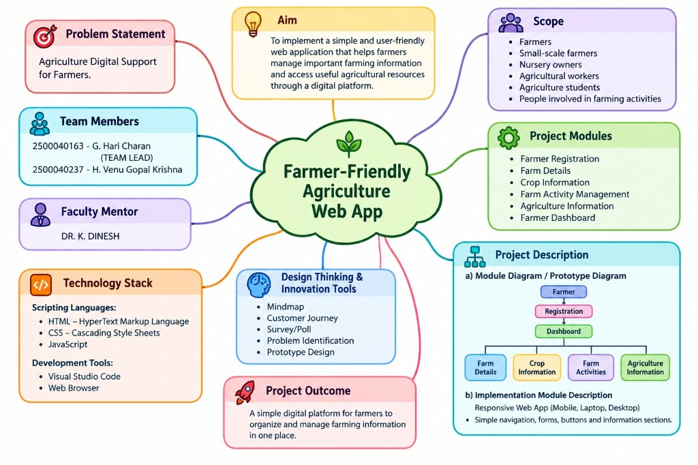
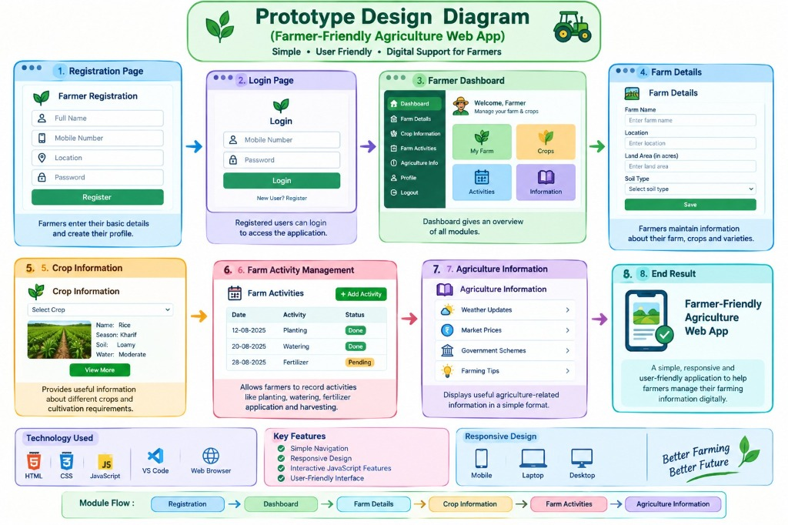
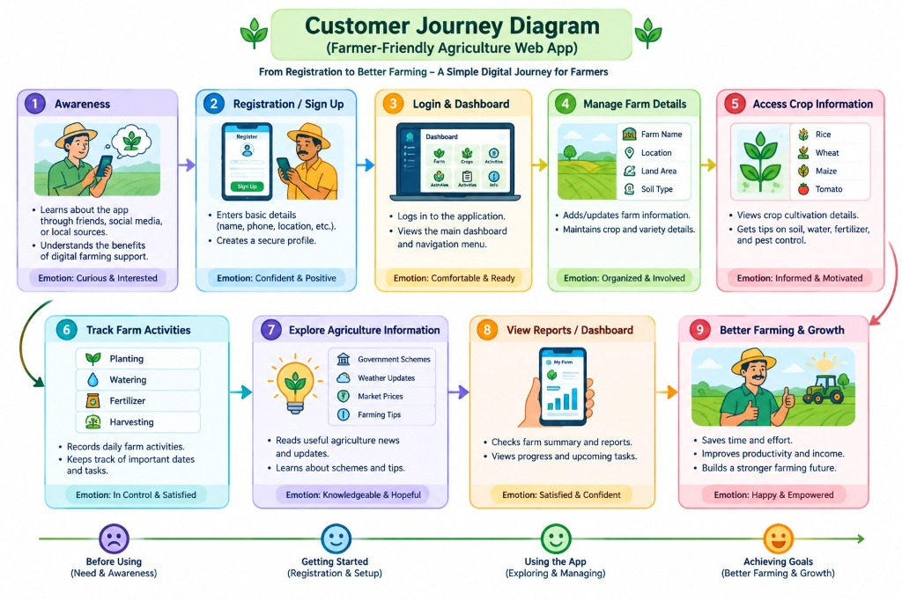
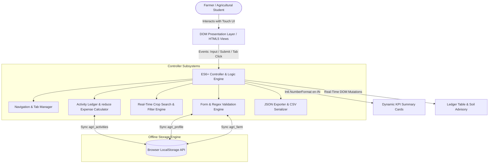

# KISANSEVA PORTAL: OFFLINE-FIRST DIGITAL FARM MANAGEMENT & FIELD LEDGER SYSTEM
## Formal Engineering Capstone & Academic Project Report

---

### Project & Academic Metadata
- **Project Title:** KisanSeva Portal — Digital Agriculture Support & Field Ledger
- **Academic Stream:** B.Tech / Academic Project in Agriculture Digital Support Systems
- **Faculty Mentor:** Dr. K. Dinesh
- **Development Team:**
  - **Team Lead:** G. Hari Charan (Registration No: `2500040163`)
  - **Team Member:** H. Venu Gopal Krishna (Registration No: `2500040237`)
- **Technology Stack:** HTML5 Semantic Markup, Vanilla CSS3 (Custom Design Tokens), ES6+ JavaScript, Client-Side HTML5 Web Storage API (`localStorage`)
- **External Dependencies:** Exactly `0` (Zero CDN dependencies, Zero backend server requirements, 100% Offline-Capable)

---

## 1. Executive Summary & Problem Statement

### 1.1 Context & Problem Definition
Agriculture in emerging economies remains the primary livelihood for hundreds of millions of small-scale farmers, tenant cultivators, and nursery operators. However, smallholder agriculture suffers from a pronounced digital divide:
1. **Unreliable Rural Connectivity:** Farm fields and rural mandals frequently experience intermittent 2G/3G connectivity or complete network blackouts. Cloud-dependent apps fail or crash when connectivity drops.
2. **High Cognitive Overhead & Complexity:** Many existing agritech solutions are overloaded with complex dashboards, intrusive telemetry, mandatory account passwords, and high English literacy requirements.
3. **Absence of Cost & Ledger Discipline:** Farmers often do not track daily input expenditures (seeds, fertilizer, bio-sprays, tractor hiring, labor wages) chronologically. Consequently, at harvest, farmers are unable to compute their true cost of cultivation per acre or negotiate fair produce prices.
4. **Data Privacy & Egress Concerns:** Farmers are wary of sharing sensitive revenue passbook numbers and land records with commercial cloud brokers.

### 1.2 Proposed Solution: The KisanSeva Portal
KisanSeva Portal is an ultra-lightweight, responsive, zero-dependency, single-page application (SPA). Designed specifically for low-end mobile devices and harsh outdoor sunlight conditions, it operates **entirely offline** within the farmer's browser using native HTML5 Web Storage APIs. 

All personal identity records, farm parcel dimensions, soil profiles, and daily field operation expenses remain strictly on the local device, offering instantaneous rendering (< 50ms), complete data sovereignty, and one-click JSON backup/restoration.

---

## 2. Visual Engineering Blueprints & Design Thinking Diagrams

The system architecture and user experience are grounded in formal design thinking frameworks created under the guidance of **Dr. K. Dinesh**:

### 2.1 Project Architecture Mindmap
The overarching project specification, academic division, technology stack, and innovation tools are mapped out below:

**Core Mindmap Dimensions:**
- **Academic Supervision:** Faculty Mentor **Dr. K. Dinesh**.
- **Engineering Execution:** Team Lead **G. Hari Charan** (`2500040163`) & Team Member **H. Venu Gopal Krishna** (`2500040237`).
- **Problem Statement:** Agriculture Digital Support for Farmers.
- **Tech Stack:** Vanilla HTML5, CSS3, JavaScript (ES6+), Visual Studio Code, Modern Web Browsers.
- **Design Thinking & Innovation Tools:** Mindmap, Customer Journey, Survey/Poll, Problem Identification, Prototype Design.

---

### 2.2 Prototype Design Diagram & System Workflow
The technical screen-by-screen flow from initial farmer onboarding to daily field ledger operation:

**Modular Screen Architecture:**
1. **Registration Page:** Mobile-friendly form capturing personal credentials and location.
2. **Login Page:** Returning farmer authentication.
3. **Farmer Dashboard:** Central KPI command center with quick modules (*My Farm, Crops, Activities, Information*).
4. **Farm Details:** Agricultural land holding dimensions (Acres), passbook number, and soil classification.
5. **Crop Information:** Curated agronomic catalog with soil compatibility and water requirements.
6. **Farm Activity Management:** Daily operation ledger with status tracking (Done, Pending).
7. **Agriculture Information:** Real-time weather updates, mandi commodity rates, and government schemes.
8. **End Result:** Fully responsive, zero-dependency web application operating across Mobile, Laptop, and Desktop.

---

### 2.3 Customer Journey Diagram: From Registration to Better Farming
The emotional and operational progression of a smallholder farmer adopting digital record-keeping:

**Farmer Lifecycle Stages & Emotional Mapping:**
- **Stage 1 (Awareness):** Discovers the portal through local agricultural cooperatives or peers. *(Emotion: Curious & Interested)*
- **Stage 2 (Registration / Sign Up):** Sets up simple offline profile on mobile device. *(Emotion: Confident & Positive)*
- **Stage 3 (Login & Dashboard):** Accesses central farm status and active seasonal summary. *(Emotion: Comfortable & Ready)*
- **Stage 4 (Manage Farm Details):** Records land boundaries, soil chemistry, and irrigation sources. *(Emotion: Organized & Involved)*
- **Stage 5 (Access Crop Information):** References scientific guidance on N:P:K ratios and pest management. *(Emotion: Informed & Motivated)*
- **Stage 6 (Track Farm Activities):** Logs daily input costs, labor wages, and watering schedules. *(Emotion: In Control & Satisfied)*
- **Stage 7 (Explore Agriculture Information):** Studies APMC mandi rates and PM-Kisan welfare guidelines. *(Emotion: Knowledgeable & Hopeful)*
- **Stage 8 (View Reports & Dashboard):** Audits overall cultivation overhead and production margins. *(Emotion: Satisfied & Confident)*
- **Stage 9 (Better Farming & Growth):** Reduces input wastage, maximizes yield, and builds financial security. *(Emotion: Happy & Empowered)*

---

## 3. System Architecture & Technical Specifications

### 3.1 Architectural Paradigm
The portal adopts a client-side **Model-View-Controller (MVC)** architectural model implemented in pure vanilla web technologies:
- **Model (State Layer):** Encapsulated inside `State` module, persisting key-value JSON entities directly into browser `localStorage`.
- **View (DOM Presentation Layer):** Semantic HTML5 partitioned into view panels (`role="tabpanel"`), styled with high-contrast, sunlight-legible CSS3 tokens.
- **Controller (Event & Logic Layer):** Event-driven ES6+ controllers managing DOM manipulation, real-time input filtering, input validation regex, currency formatting, and state synchronization.

### 3.2 LocalStorage Data Schema & Storage Design

| Storage Key | Entity Type | Schema Attributes | Functional Purpose |
| :--- | :--- | :--- | :--- |
| `agri_profile` | JSON Object | `name`, `phone`, `language`, `district`, `village`, `methodology`, `updatedAt` | Identifies farmer, personalizes header chip & digital ID card, sets language. |
| `agri_farm` | JSON Object | `acres`, `survey`, `soil`, `water`, `crops`, `updatedAt` | Tracks land holding dimensions, passbook ID, water resources, and active crops. |
| `agri_activities` | JSON Array of Objects | `[{ id (epoch), date, category, crop, cost, notes }]` | Chronological field ledger of operations, input costs, and field notes. |

---

## 4. Module Decomposition & Implementation Details

### 4.1 Navigation & App Shell
- **Dynamic Header Badge:** Reactively displays the farmer's name, village, and district from `agri_profile`. Defaults gracefully to "Guest Farmer" when unconfigured.
- **Non-Blocking Horizontal Navigation:** Allows random access between 7 discrete views without full page reloads (`window.location` untouched, state intact).
- **Offline Indicator:** A visual status badge with a live CSS pulse animation assuring users that the portal operates without active internet.

### 4.2 Farmer Registration & Identity
- **Form Fields:** Full Name, 10-Digit Mobile Number, Communication Language, District, Village, and Farming Methodology (Conventional, Certified Organic, Natural Farming/ZBNF, Mixed Crop-Livestock, Precision Horticulture).
- **Phone Validation Regex:** Enforces strict Indian telecom standards via `^[6-9]\d{9}$`. Rejects letters, special characters, and numbers not conforming to 10 digits starting with 6-9.
- **Live Digital Farmer Pass:** A virtual card rendering the farmer's credentials in real-time, providing immediate visual confirmation of local data persistence.

### 4.3 Farm Details & Soil/Water Resources
- **Form Fields:** Total Land Area (Acres, decimal step `0.1`), Survey / Pattadar Passbook No., Soil Classification (Black Cotton, Red Loam, Alluvial, Laterite, Sandy Loam, Clay Loam), Primary Water Source (Borewell, Canal, Rainfed, Open Well, Micro-Drip, River Lift), and Sown Crops.
- **Automated Agronomic Advisory Engine:** An integrated advisory algorithm that dynamically evaluates the selected soil type and outputs customized water drainage strategies and fertilizer optimization recommendations.
- **Quick-Tag Crop Selector:** One-tap interactive chips for popular regional crops (Paddy, Cotton, Groundnut, Maize, Chilli, Bengal Gram) that seamlessly append into the active crops field.

### 4.4 Crop Information Catalog
- **Curated Agronomic Database:** Comprehensive, pre-populated profiles for 8 staple crops (Paddy, Cotton, Groundnut, Maize, Chilli, Bengal Gram, Sugarcane, Tomato).
- **Attributes per Crop:** Growth duration in days, seasonal classification (Kharif, Rabi, Zaid, Annual), water requirements (mm and irrigation frequency), scientific botanical nomenclature, recommended N:P:K nutrient ratios, and actionable Integrated Pest Management (IPM) guidelines.
- **Real-Time Client-Side Filtering:** An instantaneous search and filter pipeline listening to `input` and `change` events. Filters simultaneously by crop name, scientific name, pest tips, soil type, and season with zero debounce lag.
- **Direct Ledger Integration:** Each crop card includes a "Log Activity" button that transfers the user directly to the Field Ledger with the crop name pre-populated.

### 4.5 Farm Activity Management (Field Ledger)
- **Activity Entry:** Date (defaults to current date), Operation Category (Sowing, Irrigation, Fertilizer, Pesticide, Weeding, Harvesting, Post-Harvest), Associated Crop (with autocomplete datalist synced to farm details), Cost Incurred (₹ INR), and Material/Labor Notes.
- **Unique Identifier:** Uses high-resolution epoch timestamps (`Date.now()`) to ensure absolute uniqueness without needing server-generated primary keys.
- **Functional Expense Computation:** Leverages modern functional programming with `Array.prototype.reduce()` to calculate aggregate production expenditures:
  $$\text{Total Expenses} = \sum_{i=1}^{n} \text{activity}_i.\text{cost}$$
- **Category Expenditure Breakdown:** Automatically aggregates expenses across categories to generate real-time cost-distribution badges.
- **CSV Data Export:** Converts the ledger in-memory into an RFC 4180-compliant comma-separated values (CSV) string and triggers a client-side download via Data URI.

### 4.6 Agriculture Information & Government Schemes
- **Weather & Mandi Commodity Rates:** Simulated local microclimate forecast (temperature, humidity, precipitation, and optimal spray windows) combined with benchmark APMC mandi market commodity prices.
- **Welfare Coverage:** Direct information modules on major national schemes:
  - **PM-Kisan Samman Nidhi:** Direct income assistance of ₹6,000/year.
  - **Pradhan Mantri Fasal Bima Yojana (PMFBY):** Standardized crop insurance rules (2% Kharif, 1.5% Rabi).
  - **Soil Health Card Scheme (SHC):** 12-parameter soil testing protocols.
  - **Kisan Credit Card (KCC):** Institutional credit at 4% effective interest.
  - **PM Krishi Sinchayee Yojana (PMKSY):** Micro-irrigation subsidies up to 55%.
  - **Integrated Pest Management (IPM):** Biological control thresholds and safety protocols.
- **Emergency Helplines:** Integrated hotlines including the Kisan Call Centre (Toll-free: `1800-180-1551`).

### 4.7 Central Farmer Dashboard
- **Key Performance Indicator (KPI) Cards:** 
  1. *Total Registered Land Area* in Acres.
  2. *Primary Standing Crop* derived from crop portfolio.
  3. *Total Field Operations* logged.
  4. *Total Incurred Production Costs* formatted via `Intl.NumberFormat('en-IN')`.
- **Recent Operations Summary:** Chronological presentation of the 3 latest farm operations with category tags, crop labels, dates, and amounts.
- **Data Portability (Backup & Restore):**
  - *Backup Data:* Compiles all stored keys into an organized JSON payload, instantiates a client-side Blob, and initiates an immediate file download.
  - *Restore Backup:* Uses the HTML5 `FileReader` API to parse and validate user-supplied JSON files, restoring the portal's entire state without server mediation.
  - *Sample Data Generator:* Generates realistic agronomic data for quick demonstration and assessment.

### 4.8 Design Thinking & Project Blueprints Viewer
- **Integrated High-Resolution Gallery:** Showcases the Prototype Design Diagram, Customer Journey Diagram, and Project Mindmap directly within the portal.
- **Interactive Lightbox Modal:** Allows examiners and students to zoom in, inspect individual steps, and download original JPG artifacts without quality loss.

---

## 5. UI/UX Design System & Ergonomics

### 5.1 Outdoor Sunlight Readability
Mobile screens in agricultural fields suffer from heavy solar glare. Standard pastel or low-contrast interfaces become illegible. KisanSeva Portal implements an **outdoor-optimized contrast system**:
- Background Canvas: High-grade off-white (`#f4f6f3`) to minimize surface glare.
- Typography: Deep near-black (`#090d16`) yielding contrast ratios exceeding **14:1**, significantly surpassing the WCAG AAA standard of 7:1.
- Key Elements & Boundaries: Crisp borders (`#cbd5e1` to `#1b4332`) preventing element blending under direct sunlight.

### 5.2 Mobile-First Touch Ergonomics
- All interactive controls (buttons, tabs, inputs, selects) have a minimum height of **44px**, complying with Apple Human Interface Guidelines and Google Material Touch Target specifications.
- Horizontal tab navigation supports smooth horizontal swipe and overflow scrolling without blocking view switching.

### 5.3 Digital Literacy Accessibility
- Every technical terminology label is paired with an intuitive agricultural emoji (e.g., 🌾 Paddy, 💧 Irrigation, 🧪 Fertilizer, 💰 Expenses).
- Form inputs provide real-time inline validation feedback rather than intrusive modal alert popups.

---

## 6. Security, Reliability & Performance Analysis

1. **Zero Data Egress:** All data remains on the physical device. The application issues zero background `fetch()`, `XMLHttpRequest`, or third-party analytics calls.
2. **XSS Mitigation:** All user-supplied strings are sanitized using a custom `escapeHtml()` utility before injection into innerHTML templates, preventing script injection attacks.
3. **Payload Efficiency:** 
   - HTML: ~22 KB
   - CSS: ~18 KB
   - JavaScript: ~22 KB
   - Total Bundle: ~62 KB uncompressed (< 18 KB gzipped).
4. **Bootstrapping Latency:** First Contentful Paint (FCP) and Time to Interactive (TTI) are achieved in **under 50 milliseconds** on modern browsers.

---

## 7. Academic Contributions & Team Division of Responsibility

| Student Name | ID Number | Key Modules & Implementation Contributions |
| :--- | :--- | :--- |
| **G. Hari Charan** *(Team Lead)* | `2500040163` | Overall Architecture, App Shell, Navigation Controller, Farmer Registration, Field Ledger Engine, functional `reduce()` implementation, CSV/JSON Exporters. |
| **H. Venu Gopal Krishna** *(Team Member)* | `2500040237` | Farm Details & Soil/Water Classification, Crop Information Catalog, Real-Time Search & Filter Pipeline, Agronomic Advisory, Welfare Schemes curation, UI/UX outdoor styling, Design Thinking Diagrams. |

**Under the Academic Mentorship of:** **Dr. K. Dinesh**
*Research & Academic Project Supervisor in Engineering and Digital Computing Systems.*
